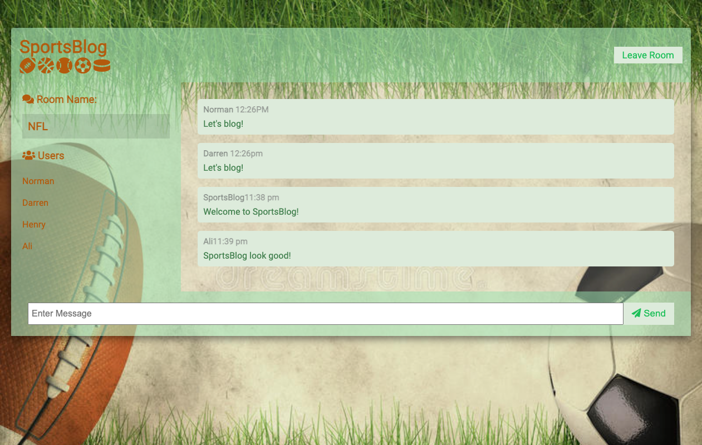
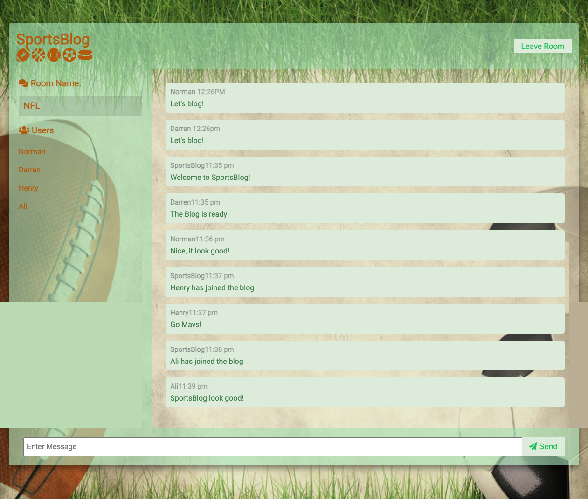
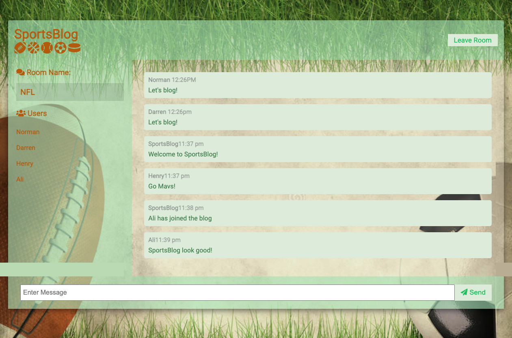
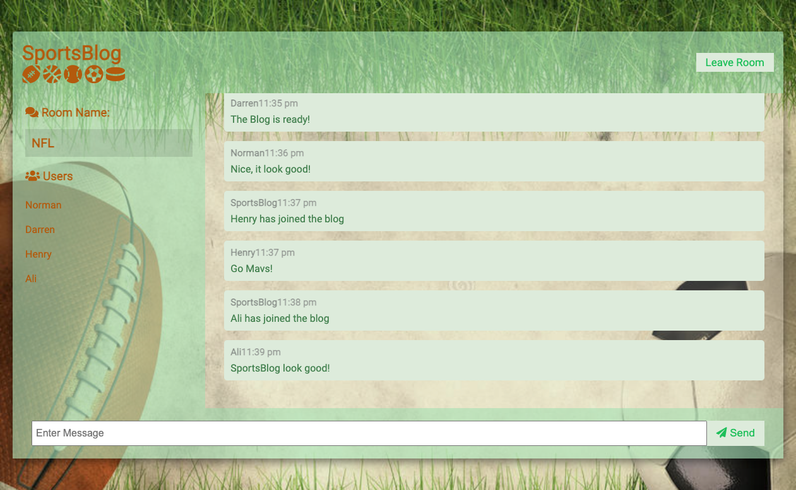
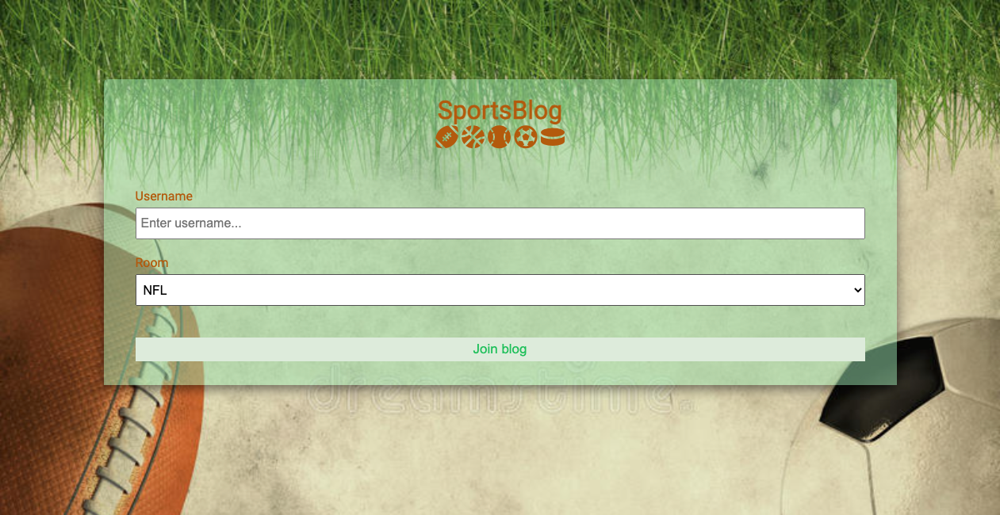

# Blog Sports

# Description

The purpose of this blog is to provide any fan the ability to blog with another fan about a sport. The app has the option to choose the sport room such as NFL, NBA, MLS, NHL, and MLB.   

[Heroku app deployed](https://sports-blog-project2.herokuapp.com/)

 
# Instructions
Users have to sign-up before using the Sport Blog app. Then log-in to the main page. 

# Usage
. Run npm install to install all dependencies.
. Launch the app with node server.js.

# Technologies / APIs used in the creation of this app:.

- socketio
- Bootstrap
- Dotenv
- Heroku
- Express
- formatMessage

# Contributors:

- Ali Arab
- Darren Watson 
- Henry Aldous
- Norman Cerros
